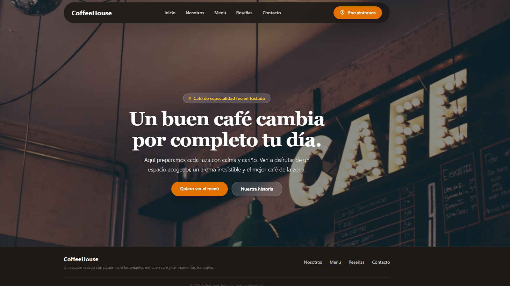

# ☕ Coffee House | Aplicación Web para Cafetería Artesanal

Coffee House es una aplicación web moderna y elegante diseñada específicamente para una cafetería artesanal. La app conecta una interfaz interactiva con Supabase para ofrecer una experiencia acogedora y funcional en tiempo real.

## 🌐 Demo

* **Sitio Web:** [coffeehouse-project.netlify.app](https://coffeehouse-project.netlify.app)


## 🎯 Sobre el Proyecto

Desarrollé este proyecto orientado al sector de la restauración y hostelería. Permite a los clientes explorar productos actualizados desde la base de datos, conocer la filosofía del local, ver galerías de imágenes y gestionar contacto directo de forma segura.

## ✨ Qué puede hacer la aplicación

* **Menú interactivo en tiempo real:** Muestra las especialidades de café, descripciones y precios obtenidos directamente desde la base de datos de Supabase (con almacenamiento en caché local).
* **Sección de Nosotros y Galería:** Espacios visuales diseñados para mostrar el ambiente, la historia y los momentos únicos de la cafetería.
* **Reseñas de clientes:** Apartado dedicado a mostrar las opiniones y valoraciones de los visitantes.
* **Formulario de contacto integrado:** Permite a los usuarios enviar consultas y mensajes directos gestionados a través de Formspree.
* **Diseño adaptativo (Responsive):** Interfaz fluida con una estética cálida y moderna, optimizada tanto para dispositivos móviles como para ordenadores.

## 🛠️ Tecnologías Utilizadas

* **Frontend:** React + TypeScript
* **Empaquetador:** Vite
* **Estilos:** Tailwind CSS
* **Navegación:** React Router
* **Base de Datos:** Supabase
* **Formularios:** Formspree
* **Hosting y Despliegue:** Netlify
* **Control de Versiones:** Git & GitHub

## 💻 Instalación y Uso Local

Si quieres probar el proyecto en tu máquina local:

1. Clona el repositorio:
   ```bash
   git clone [https://github.com/CarolinaOM/coffee-house.git](https://github.com/CarolinaOM/coffee-house.git)
   cd coffee-house